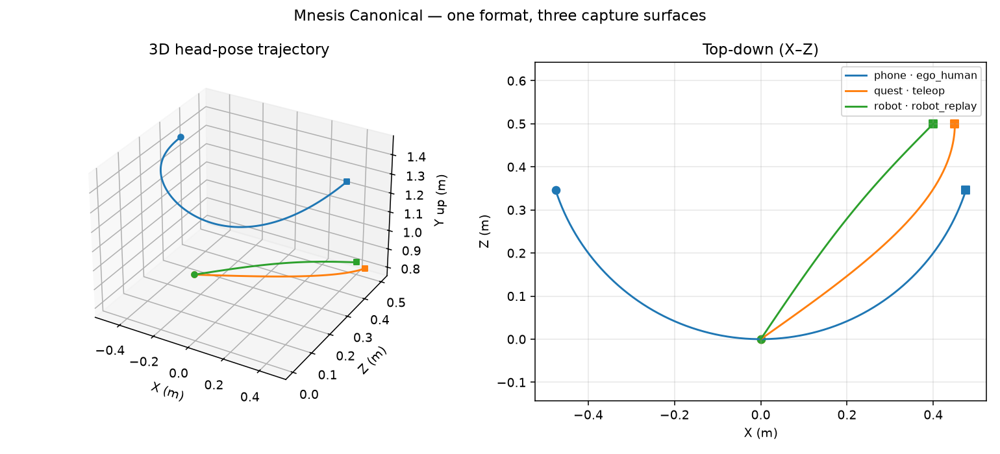

# mnesis-canonical

> **Mnesis Canonical Schema** — the open standard for embodied spatial-action data.
> The "USB-C of robot-trainable data": one format every capture surface emits and
> the Mnesis Ambrosia platform ingests. **Apache-2.0** — free to adopt, by design.

This is Mnesis Labs' **open layer** (Open-Core strategy, Parthenon `01 §2`): the
schema + reference validator + device-abstraction SDK are open so they become the
de-facto standard; the proprietary core (high-fidelity data, 4DGS physics, eval)
lives in Mnesis Ambrosia.

## 30-second demo
One format, three capture surfaces — **phone, Quest, robot** — all emit the same
schema, all pass the same validator, all export to LeRobot (training) and Isaac
(sim) with no re-labeling:

```bash
pip install -e ".[viz]"
python -m mnesis_canonical demo          # writes ./demo_out/ (data + LeRobot + Isaac + plot)
```
```
Mnesis Canonical — demo: one format, three capture surfaces

  surface               frames  durationMs  valid
  phone·ego_human           90        2967  OK
  quest·teleop              60        1967  OK
  robot·robot_replay        60        1180  OK
```


> Same `head_pose_SE3` field, three real motions — handheld ego scan, teleop
> reach, robot replay — drawn from the identical canonical frames.

## What's here
- [`SPEC.md`](SPEC.md) — the authoritative specification (field-by-field).
- `mnesis_canonical/` — reference Python implementation: typed `CanonicalFrame`,
  `validate_frame` / `validate_frames`, `read_jsonl` / `write_jsonl`.
- `examples/` — tiny valid episodes across capture surfaces: `episode_0`
  (phone / `ego_human`), `episode_quest` (Quest / `teleop`), `episode_robot`
  (robot / `robot_replay`).

## Install / use
```bash
pip install -e ".[dev]"
```
```python
from mnesis_canonical import read_jsonl, validate_frames
report = validate_frames(read_jsonl("episodes/ep_0/data.jsonl"))
print(report.ok, report.total, report.errors)
```
Validate an episode from the shell (exits non-zero on error — CI/ingest gate):
```bash
python -m mnesis_canonical validate episodes/ep_0/data.jsonl   # or: mnesis-canonical validate ...
```
Move episodes to/from LeRobot's columnar layout (exact round-trip):
```python
from mnesis_canonical import to_lerobot, from_lerobot
columns = to_lerobot(read_jsonl("episodes/ep_0/data.jsonl"))
frames = from_lerobot(columns)
```
Optional strict JSON-Schema backend: `pip install "mnesis-canonical[jsonschema]"`,
then `validate_frame_jsonschema(frame)` (or use the bundled
`mnesis_canonical/canonical_frame.schema.json` from any language).

## Test / lint (what CI runs)
```bash
ruff check . && pytest -q
```

## Who depends on this
`EgoWear` (phone) · `ProdigyHelper` (Quest) · `TeleOP-Alohamini` (robot) all emit
this schema; `mnesis-ambrosia` validates ingest against it. Change the schema **here
first** (SPEC + reference impl), then sync consumers — never fork the fields per repo.

## Referencing this as a standard
The spec is versioned and the package `__version__` mirrors it. Pin against the
minor line and you get a stable wire format:
```toml
# pyproject.toml / requirements
mnesis-canonical ~= 0.1   # additive-only within 0.1.x
```
**Compatibility commitment**
- **SemVer-of-the-schema**: additive fields = **minor**; any breaking field
  change = **major** + a migration note (see [`SPEC.md`](SPEC.md) §Versioning).
- **Iron rules that will not silently change** (SPEC §Conventions): quaternion
  order `{x,y,z,w}` scalar-last, right-handed; `action` is a **relative** delta;
  `t_hw_ns` is the pose↔video join key; dotted keys are LeRobot-style flat columns.
- **LeRobot** mapping stays 1:1; **Isaac/GR00T** alignment is tracked in
  `SPEC.md` §Compatibility (open items flagged before any field is frozen).
- Contract changes land **here first** (SPEC + reference impl), then consumers sync.

## Status
v0.1 scaffold (seeded from EgoWear `schema/CanonicalFrame`). Roadmap → `docs/SPRINT_S1.md`.
Cross-repo plan → Parthenon `research/platform-and-repo-roadmap.md`.
